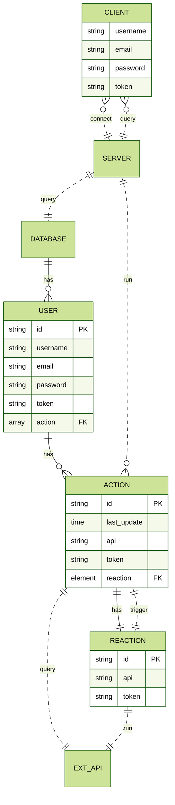

# AREA

Bussiness application connecting services to automate tasks between them.<br>
Developed in React, Express and MongoDB.

# Usage

It is assumed that the user already has a working [Docker installation][1] on their machine.

## Packages

Connect to [Docker Hub][2] and run the latest version of the package:

```shell
docker container run -d --rm -p 8080:8080 --name area-server ghcr.io/epitechpromo2025/area-server
docker container run -d --rm -p 8081:8081 --name area-client ghcr.io/epitechpromo2025/area-client
```

To stop the containers run: `docker stop area-server area-client`

## Building from source

```shell
git clone git@github.com:EpitechPromo2025/B-DEV-500-LIL-5-1-area-romain.leemans.git
cd B-DEV-500-LIL-5-1-area-romain.leemans
docker-compose up --build
```

Hit `Ctrl+C` to stop the containers.

Compilation only: `docker-compose build`

## Open the application

- Open your browser and go to [http://localhost:8081][3]
- Download amd install the [mobile application][4]

# About the project

## Goal

The goal of this project is to discover, as a whole, the software platform that you have chosen through the creation of a business application. <br>
To do this, we implemented a software suite that functions similar to that of IFTTT and/or Zapier.

This software suite can be broken down into three parts:

- An application server with the following components:
  - A REST API
  - An authentication system
  - A MongoDB database
  - Actions:
    - Intranet notification
    - New Tweet mentioning the user
  - Reactions:
    - Send an email
    - Set a Microsoft Teams status
- A web client to use the application from your browser by querying the application server
- A mobile client to use the application from your phone by querying the application server

## Architecture

<!--
|o 	o| 	Zero or one
|| 	|| 	Exactly one
}o 	o{ 	Zero or more (no upper limit)
}| 	|{ 	One or more (no upper limit)

PK primary key
FK foreign key
 -->

Here is a diagram of the architecture of the application. <br>



<!-- Links -->
[1]:https://docs.docker.com/get-docker/
[2]:https://docs.github.com/en/packages/working-with-a-github-packages-registry/working-with-the-container-registry#authenticating-to-the-container-registry
[3]:http://localhost:8081
[4]:https://localhost:8081/client.apk