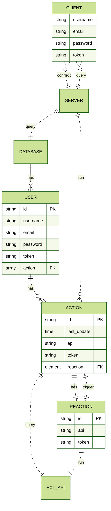

# AREA

Bussiness application connecting services to automate tasks between them.<br>
Developed in React, Express and MongoDB.

# Usage

It is assumed that the user already has a working [Docker installation][1] on their machine.

## Building from source

```shell
git clone git@github.com:EpitechPromo2025/B-DEV-500-LIL-5-1-area-romain.leemans.git
cd B-DEV-500-LIL-5-1-area-romain.leemans
docker-compose up --build
```

Hit `Ctrl+C` to stop the containers.

Compilation only: `docker-compose build`

## Open the application

- Open your browser and go to [http://localhost:8081][2]
- Download amd install the [mobile application][3]

# About the project

## Goal

The goal of this project is to discover, as a whole, the software platform that you have chosen through the creation of a business application. <br>
To do this, we implemented a software suite that functions similar to that of IFTTT and/or Zapier.

This software suite can be broken down into three parts:

- An application server with the following components:
  - A REST API
  - An authentication system
  - A MongoDB database
  - Actions:
    - Intranet notification
    - New Tweet mentioning the user
  - Reactions:
    - Send an email
    - Set a Microsoft Teams status
- A web client to use the application from your browser by querying the application server
- A mobile client to use the application from your phone by querying the application server

## Architecture

<!--
|o 	o| 	Zero or one
|| 	|| 	Exactly one
}o 	o{ 	Zero or more (no upper limit)
}| 	|{ 	One or more (no upper limit)

PK primary key
FK foreign key
 -->

Here is a diagram of the architecture of the application. <br>



## Technologies Used

To ensure we are the most efficient equally on the client-side and server-side we splitted the project between two main framework assisted by multiples librairies and a no-sql database

### ExpressJS
Used for the back-end of the project ExpressJS is a framework based on nodeJS, it's a web application framework that provides broad features for building web and mobile applications we use it's simple routing for requests made by clients and middleware that is responsible for making decisions to give the correct responses for the requests made by the client

### ReactJS

For the front-end and client side we use React a Javascript framework, we choose React for it's component system ,easy syntax, maintainability and because react is well documented and used by a majority of front-end developpers, it also work very well with the technox used for the server-side (NodeJs/ExpressJs)

### MongoDB
MongoDB is an open source NoSQL database used to store our Actions-Reactions data and our users.
we use to store structured or unstructured data. It uses a JSON-like format to store documents in object which makes it really fast and easy to use by deleting the "normalization of the data" process which can take a lot of time in large-scale applications

### Usage of Webhooks

To make sure we recieve webhooks alerts locally we will use a command-line application to deploy our localhost to the internet
the tool used is called [NGROK][4]

1. Go to the [download page][5]
2. Sign up
3. Follow [the instructions][5] to add your token
4. Launch Ngrok on port 8080
```bash
ngrok http 8080
```
5. Then you simply have to paste the *Forwarding* url in the project env on the WEBHOOK_URL key


<!-- Links -->
[1]:https://docs.docker.com/get-docker/
[2]:http://localhost:8081
[3]:http://localhost:8081/client.apk
[4]:https://ngrok.com
[5]:https://ngrok.com/download